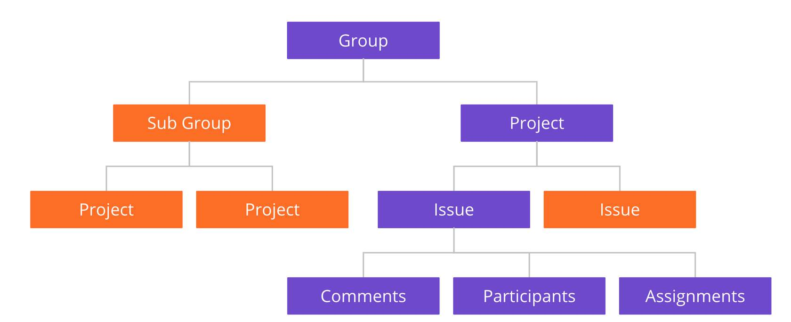
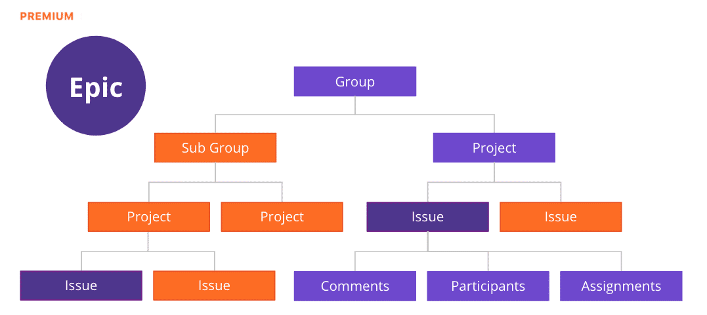

# Gitlab Comparison

## GitLab Workflow Components

| GitLab Component |                                                                                                                            Function                                                                                                                            |      Also Known As..     |
|:----------------:|:--------------------------------------------------------------------------------------------------------------------------------------------------------------------------------------------------------------------------------------------------------------:|:------------------------:|
|      Project     |                                                      The core building block where work is organized, managed, tracked and delivered to help the team to collaborate and plan work in the form of issues.                                                      |        Repository        |
|       Group      |                                                                                              A collection of projects and/or other groups. They are like folders.                                                                                              |          Project         |
|       Issue      | An issue is part of a project. It is the fundamental planning object where the team documents the use case in the description, discusses the approach, estimates the size/effort (issue weight), tracks actual time/effort, assigns work, and tracks progress. | Story, Narrative, Ticket |
|       Epic       |                                                                                  A collection of related issues across different groups and projects to help organize by theme                                                                                 |    Initiatives, Themes   |
|   Merge Request  |                            The linkage between the issue and the actual code changes. Captures the design, implementation details (code changes), discussions (code reviews), approvals, testing (CI Pipeline), and security scans.                            |       Pull Request       |
|       Label      |                                                                                Used to tag and track work for a project or group and associate issues with different initiatives                                                                               |            Tag           |
|       Board      |                                            A visual listing of projects and issues useful for teams to manage their backlog of work, prioritize items, and move issues to the team or specific stage in the project.                                           |                          |
|     Milestone    |                                                                             A sprint or deliverable(s), helping you organize code, issues, and merge requests into a cohesive group                                                                            |          Release         |
|      Roadmap     |                                                                                                   A visual representation of the various epics for the group                                                                                                   |                          |

# Gitlab Components and Navigation

## GitLab Organization Structure 

If you look at the overall Organization Structure within GitLab from a Project Management viewpoint, the group, subgroup, and project relationship could be thought of as Portfolio or Program management.

### Group
Groups are a top level organization method.  Other programs might refer to it as Projects.

With GitLab Groups, you can:

- Assemble related projects together.
- Grant members access to several projects at once.

### Sub Groups
Subgroups, also known as nested groups or hierarchical groups, allow you to have up to 20 levels of groups.

By using subgroups you can do the following:

- Separate internal / external organizations. Since every group can have its own visibility level, you are able to host groups for different purposes under the same umbrella.
- Organize large projects. For large projects, subgroups makes it potentially easier to separate permissions on parts of the source code.
- Make it easier to manage people and control visibility. Give people different permissions depending on their group membership.

### Projects
In GitLab, you can create projects for hosting your codebase, use it as an issue tracker, collaborate on code, and continuously build, test, and deploy your app with built-in GitLab CI/CD.

Your projects can be available publicly, internally, or privately, at your choice. GitLab does not limit the number of private projects you create.

### Issues
Issues are always associated with a specific project, but if you have multiple projects in a group, you can also view all the issues collectively at the group level.

Common use cases include:

- Discussing the implementation of a new idea
- Tracking tasks and work status
- Accepting feature proposals, questions, support requests, or bug reports
- Elaborating on new code implementations

### Issue Features
Once you create an issue you can add participants and communicate with them using Comments. You can also assign participants to the issue to help track who is responsible for what.

## GitLab Epics    

Epics let you manage your portfolio of projects more efficiently and with less effort by tracking groups of issues that share a theme, across projects and milestones.

Epics allow you to group related issues and epics together. This is useful if you want better visibility of related issues. For example, you might want to see all of the issues in a project in a roadmap and generate a Gantt chart for your program or portfolio.
