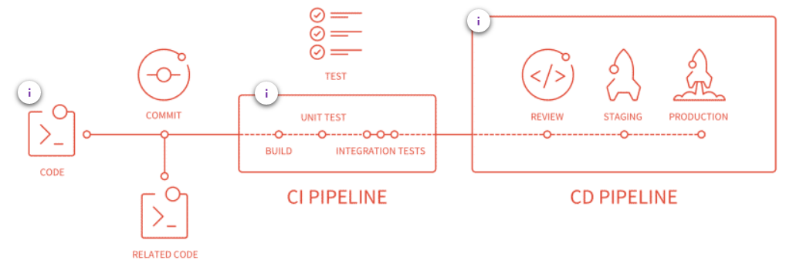
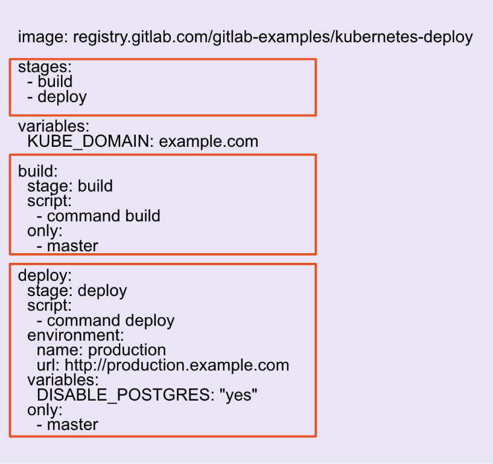
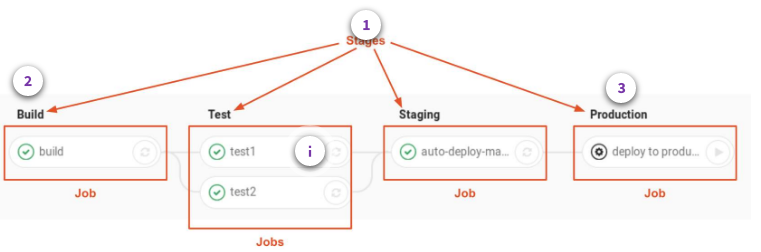

# Git Basics

## What is Git?

Git is a free and open source distributed version control system(VCS) designed to handle everything from small to large projects with speed and efficiency. GitLab is a Git-based fully integrated platform for software development.

## Characteristics of Git

- **Distributed**- Does not require a constant connection to a central server. 

- **Adaptive**- Git's branching model can adapt to fit the workflow of almost any team. 

- **Fast & Reliable**- Git branches are sparse, allowing for change-only tracking. 

- **Flexible**- Git can be command line or GUI driven, allowing everyone to contribute easily. 

# Basic Code Creation in Gitlab

# Gitlab's CI/CD Functions

## Defining CI/CD 
**Continuous Integration** is the practice of merging all the code that is being produced by developers. The merging usually takes place several times a day in a shared repository. From within the repository, or production environment, building and automated testing are carried out that ensure no integration issues and the early identification of any problems.

**Continuous Delivery** adds that the software can be released to production at any time, often by automatically pushing changes to a staging system. 

**Continuous Deployment** goes further and pushes changes to production automatically.

## Benefits of GitLab CI/CD 
- **Error Detection** - Detects errors as quickly as possible: fix problems while they are still fresh in developers mind.
- **Increased Efficiency** - Reduces integration problems: smaller problems are easier to digest and fix immediately. Bugs won't shut your whole system down.
- **No Snowball Effect** - Avoid compounding problems: allows teams to develop faster, with more confidence and collaboration.
- **Release Stages** - Ensures every change is releasable: test everything, including deployment, before calling it done with less risk on each release.
- **Valuable Delivery** - Delivers value more frequently: reliable deployments mean more releases
- **Better Feedback Processes** - Tight customer feedback loops: fast and frequent customer feedback on changes allow for continuous improvement for your product.

## How GitLab CI/CD Works 

To use GitLab CI/CD, all you need is an application codebase hosted in a Git repository, and for your build, test, and deployment scripts to be specified in a file called .gitlab-ci.yml, located in the root path of your repository.

## GitLab CI/CD: Key Ingredients
To use GitLab CI/CD you or your GitLab administrator must first define a pipeline within a YAML file called .gitlab-ci.yml and then install and configure a Gitlab Runner.
> **.gitlab-ci.yml** 
> - The YAML file is the pipeline definition file. It specified the stages, jobs, and actions that you want to perform. Think of the YAML file as the brains, and the runner as the body.

> **Gitlab Runner** 
> - A GitLab Runner, a file written in Go, will run the jobs specified in the YAML file using an API to communicate with GitLab.
> - Your GitLab administrator can configure shared runners to run on multiple projects, and you can set up your own by project.

### Example .gitlab-ci.yml File 

Here is a very basic example of a .gitlab-ci.yml file, which is is written in YAML syntax and stored in the root of a project and version controlled along with the rest of your code.

In the image on the left, you can see where the stages are being defined and then how each stage is implemented.

  

## Anatomy of a CI/CD Pipeline
This is an example of a pipeline graph that shows what the CI/CD build looks like. It lets you see how a set of one or more jobs are executed in the stages you define in the YAML file for the pipeline.

  

### Stages
- Stages are a collection of jobs to be run in parallel.
- The default stages are Build, Test, and Deploy. In the above example the ci.yml file has 4 pipeline stages definied: Build, Test, Staging, and Production.
- The stages in a pipeline run in serial to each other.

### Jobs
- Jobs are scripts that perform tasks.
  - For example: test1; test2;
- The jobs in each stage are executed in parallel.
- If one job in a stage fails, the next stage is not (usually) executed.

### Production
- Environments are where we deploy to.
  - For example: Build, Test, Staging, Production.
  - Theses are specified in the jobs within the ci.yml file.

## GitLab and AutoDevOps 
Auto DevOps gives you a pre-defined CI/CD configuration which lets you automatically detect, build, test, deploy, and monitor your applications. This makes it easier to set up every project more consistently.

It is enabled by default for all of your projects but can be disabled by your administrator at the instance level. It can be disabled and enabled by GitLab.com users at the project level, and self-managed users can also enable it at the group or instance level.

# Gitlab's Package and Release Functions

## GitLab's Package Stage 

GitLab enables teams to package their applications and dependencies, manage containers, and build artifacts with ease. The private, secure container registry and artifact repositories are built-in and preconfigured out-of-the box to work seamlessly with GitLab source code management and CI/CD pipelines. Ensure DevOps acceleration with automated software pipelines that flow freely without interruption.

### Package Registry
Every team needs a place to store their packages and dependencies. GitLab aims to provide a comprehensive solution, integrated into our single application, that supports package management for all commonly used languages and binary formats.

### Container Registry
A container registry* is a secure and private registry for Docker images built-in to GitLab. Creating, pushing, and retrieving images works out of the box with GitLab CI/CD.

*Available for Premium and Ultimate

### Helm Chart Registry
Kubernetes cluster integrations can take advantage of Helm charts to standardize their distribution and install processes. Supporting a built-in helm chart registry allows for better, self-managed container orchestration.

### Dependency Proxy
The GitLab dependency proxy* can serve as an intermediary between your local developers and automation and the world of packages that need to be fetched from remote repositories. By adding a security and validation layer to a caching proxy, you can ensure reliability, accuracy, and audit-ability for the packages you depend on.

*Available on Premier and Ultimate 

### Jupyter Notebooks
Jupyter Notebooks are a common type of code used for data-science use cases. With GitLab you can store and version control those notebooks in the same way you store packages and application code.

### Git LFS
Git LFS (Large File Storage) is a Git extension, which reduces the impact of large files in your repository by downloading the relevant versions of them lazily. Specifically, large files are downloaded during the checkout process rather than during cloning or fetching.

## GitLab's Release Stage

GitLab helps automate the release and delivery of applications, shortening the delivery lifecycle, streamlining manual processes, and accelerating team velocity. With zero-touch Continuous Delivery (CD) built right into the pipeline, deployments can be automated to multiple environments like staging and production, and the system just knows what to do without being told - even for more advanced patterns like canary deployments. With feature flags, built-in auditing/traceability, on-demand environments, and GitLab pages for static content delivery, you'll be able to deliver faster and with more confidence than ever before.
